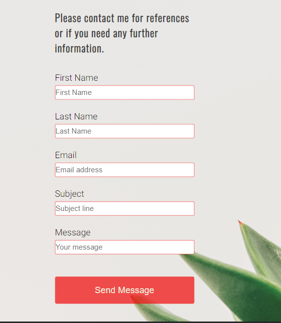

# portfolio_project_one
This is the repository of my first portfolio project. This project will focus on the use of both HTML and CSS.

# Title: Online Resume 
Online Resume is a site that is designed to display an online version of my curriculum vitae. It is intended to target potential employers and recruiters. In this project I hope to accomplish a clear design and portrayal of information about me, including an about me section, a brief employment history, a  summary of my previous education, a gallery of images showing my hobbies and finally a page allowing recruiters to contact me for my references. As I am looking to change career field, I am hoping this site will show prospective employers my skills as a software developer. 

## Features     
### Navigation Bar ->
This navigation bar will be featured on each of the three pages with active links to the Home Page, Experience Page and Contact Page. The section is designed to allow the user to navigate between pages in order to get a full image of my employment and education history as well as what interests I have outside of the workplace. 

### Site logo 
As this is an online resume I chose the logo as 'Curriculum Vitae'

### Home Page -> 

#### Hero Image 

#### About Me Section
 * This section is designed to give the user a brief description about me, my background and my hobbies. The user will be given an introduction to me and my reasons for my application. I have added a profile picture of myself a longside the description box. 

** Insert clip of About me Section here** 

#### Hobbies Section -> 
- In this section I will display a collage of images showing examples of hobbies and interests I have outside of work. This section is designed showcase the variety of activities I take part in on my time off including field hockey, rock climbing and bouldering, and snowboarding.
 

### Footer Section -> 
- This section will include my Social Media Links including: Linked In and Instagram.These links are provided to give the user a glimpse of my professional and personal social media sites. 

### History Page -> 
- This page is divided into two sections education and employment.

#### Education section -> 
- This section contains a table showing the degrees I have obtained over the last few years as well as the university attended and the years of study. I added an image of Maynooth's South Campus as it was one of my favourite locations to study. 

#### Emplyment -> 
- This section is split into two columns, the first showing my current role in Amgen and the second my previous role in UPS. I have also added the UPS logo to balance the space on the page.  

### Contact Page -> 
- This page contains a basic form that will allow users to fill in their first and last names, email address, a subject line, and brief message to request references or any further information. Each answer box has a prompt to fill in if a segment is left blank, and additionally the email address section requests that an @ sign is present.A background image was added to this page which is framed by the white header and footer sections.  

## Future Features
-	Move the education and employment history to individual pages.
-	Keep up-to-date with new information.
-	Add new footer icon for links coding portfolio alongside social media links
-   Add thank you page for submitting form. 

## Testing:  
During the testing phase of the project I realised that not all elements were responsive. This led to the implementation of Flexbox. 
**Add screenshots of different screen sizes using amiresponsive and responsinator ** 
- using google chrome dev tools I tested the following screen sizes: 
    - iphone 5 
        - gallery goes to 1x1 and all elements stacked in center of page. 
        - history page all elements stacked
    - width 1200
    - width 1300 
        - noted white space at side of hero image 
            

### Validator Testing
-	HTML
    - There were no errors found when passing code through the official <a href="https://validator.w3.org/" target=_blank rel="noopener"> W3C validator</a>.
-	CSS
    - There were no issues found when passing code through the official <a href="https://jigsaw.w3.org/css-validator/" target=_blank rel="noopener"> W3C (Jigsaw) validator</a>.
-   Lighthouse score
    - The lighthouse score for my site is 89 and was caluclated using the <a href="https://web.dev/measure/?gclid=CjwKCAiAksyNBhAPEiwAlDBeLNrgtDnjyshg858znb2oscLaGjVm-r0pRKtJ4wFMaV1Gg1nMQ7JXfBoCei4QAvD_BwE" target=_blank rel="noopener"> Lighthouse score </a> calculation site. 

### Unfixed Bugs
- When testing site on larger screen sizes it is distorted on screens of 22" and above. 

## Deployment 
- The site was deployed to GitHub pages using the following steps:
    - Select GitHub repository.
    - Navigate to settings tab and select Settings. 
    - From the menu on the right hand side select Pages.
    - In the source section select the Main Branch.
    - Once selected a green banner appears with site URL indicating sucessful deployment. 

## Credits 
### Content
-  Code Institute 
    - Love Running Walkthrough 
        -  This resource was used when adding text over my hero image. 
    - HTML and CSS essentials course materials 
        - This resource was used throughout the development of this site. 

- <a href="https://www.w3schools.com/default.asp" target="_blank" rel="noopener"> W3schools </a> was used as a resource when creating the table used to display my grades in the Education History section of my online resume. It was also used for finding additional information to be used in my form. 

- Flexbox
    - <a href="https://css-tricks.com/snippets/css/a-guide-to-flexbox/" target="_blank" rel="noopener">CSS-tricks.com</a> was used to obtain more information about implementing flexbox to my site. 
    - <a href="https://dev.to/drews256/ridiculously-easy-row-and-column-layouts-with-flexbox-1k01" target="_blank" rel="noopener">DEV.to </a> was used to aid in the design and layout of the content using flexbox. 

### Media
- <a href="https://www.pexels.com/" target="_blank" rel="noopener">Pexels.com </a> was used to obtain the hero image, 4 of the 6 gallery photos, and the background image used on my contact form. 
- <a href="https://fontawesome.com/" target="_blank" rel="noopener">Font Awesome</a> was used to obtain the social media icons used in the footer section of each page. 

## Wireframe 

